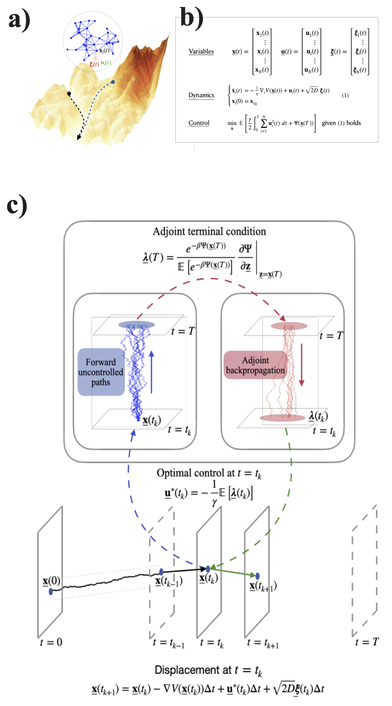

# Adjoint-Path-Integral-Ctrl
Optimal control of interacting active particles on complex landscapes





## 📌 Overview
This repository contains the **Jupyter Notebook** file used in our paper:

> **"Optimal control of interacting active particles on complex landscapes"**  
> **Authors:** Sumit Sinha, Vishaal Krishnan, and L. Mahadevan  
> **Published in:** *arXiv:2311.17039*
> **DOI:** [https://arxiv.org/abs/2311.17039](https://arxiv.org/abs/2311.17039)  


## 📜 Citation
If you use this code in your research, please cite our paper:
```bibtex
@article{sinha2023optimal,
  title={Optimal control of interacting active particles on complex landscapes},
  author={Sinha, Sumit and Krishnan, Vishaal and Mahadevan, L},
  journal={arXiv preprint arXiv:2311.17039},
  year={2023}
}
```