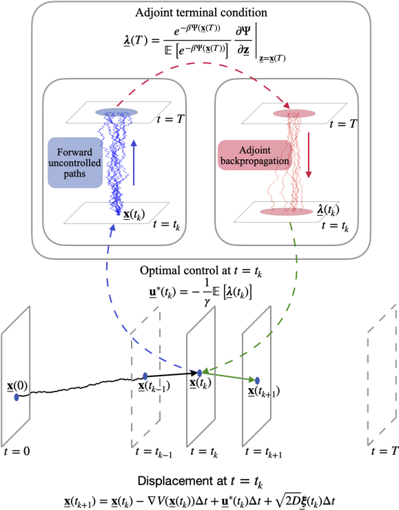

# Adjoint-based path integral control   for active many-body systems
This project combines the adjoint method with path integral control for the problem of optimal navigation of interacting active particles on complex landscapes.

## Overview

&nbsp;
&nbsp;
&nbsp;
&nbsp;
&nbsp;
&nbsp;
&nbsp;
&nbsp;
&nbsp;
&nbsp;
&nbsp;
&nbsp;
&nbsp;
&nbsp;
&nbsp;

&nbsp;

## Citation
